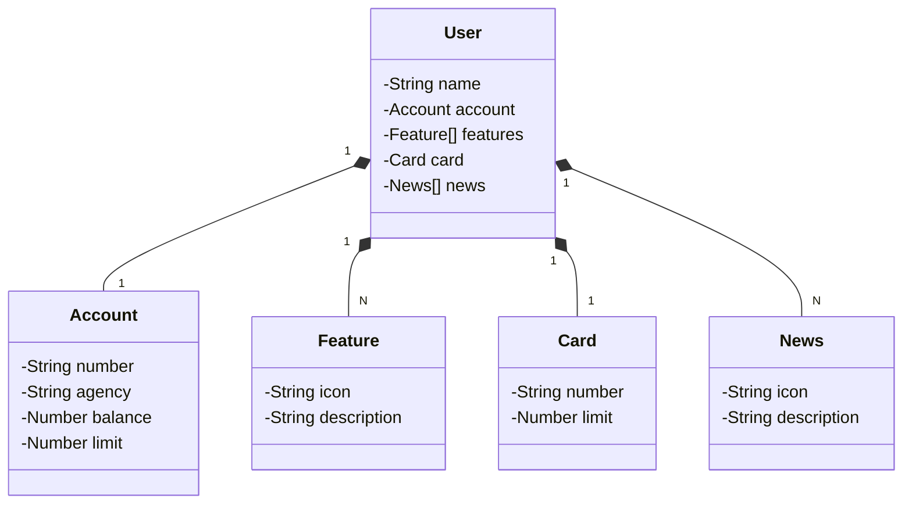

#Santander Dev Week 2023 - feito em Março 2025
Java RestFULL API criada para a Santander Dev Week

## Driagrama de Classes

```mermaid
classDiagram
  class User {
    -String name
    -Account account
    -Feature[] features
    -Card card
    -News[] news
  }

  class Account {
    -String number
    -String agency
    -Number balance
    -Number limit
  }

  class Feature {
    -String icon
    -String description
  }

  class Card {
    -String number
    -Number limit
  }

  class News {
    -String icon
    -String description
  }

  User "1" *-- "1" Account
  User "1" *-- "N"  Feature
  User "1" *-- "1"  Card
  User "1" *-- "N"  News
```
  
